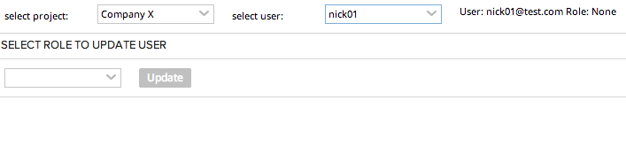

Update User Role
=========================

## Overview

Select Project:

Select User:

Select Role to assign:

Update:

Varify in Rally that the user is updated:

This app is not part of Rally App Catalog and is not supported by Rally. It is available AS IS.
## License

AppTemplate is released under the MIT license.  See the file [LICENSE](./LICENSE) for the full text.

##Documentation for SDK

You can find the documentation on our help [site.](https://help.rallydev.com/apps/2.0rc3/doc/)
